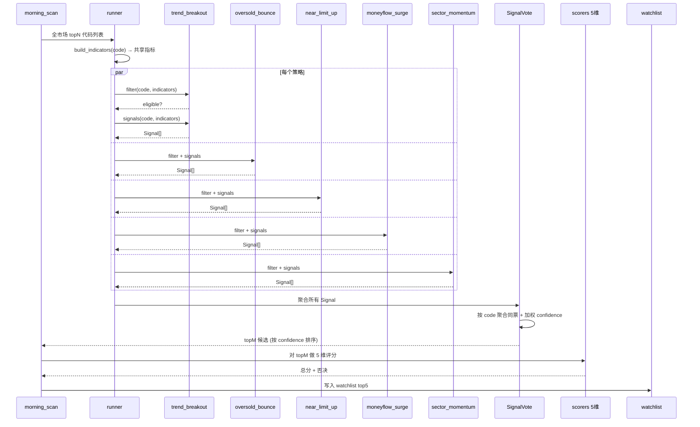
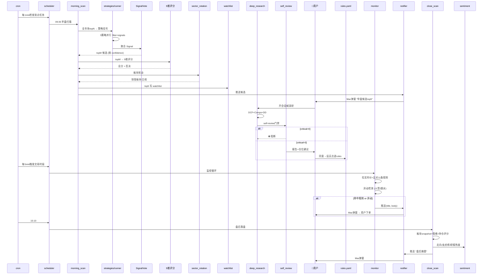
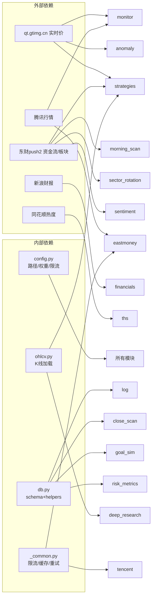
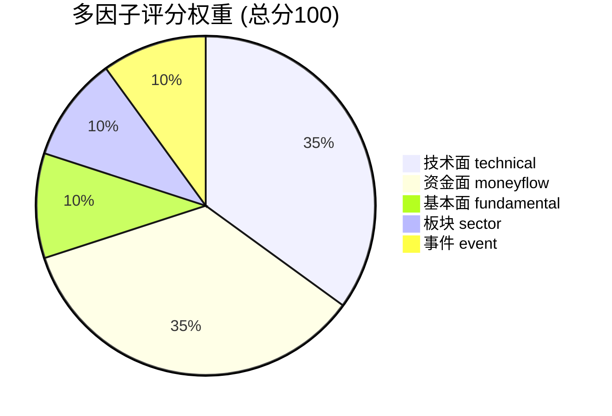
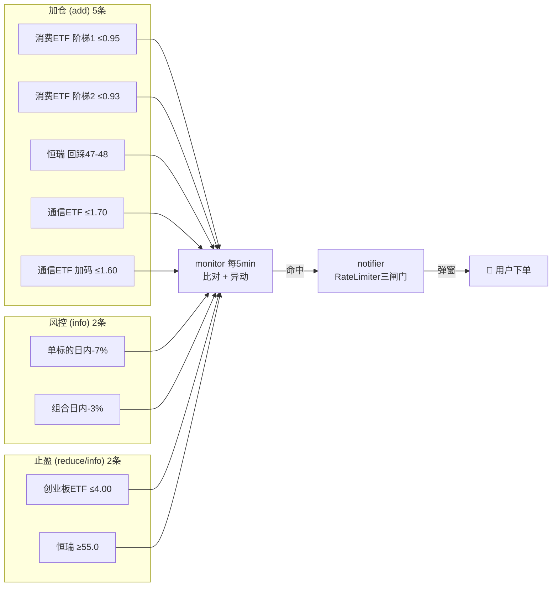
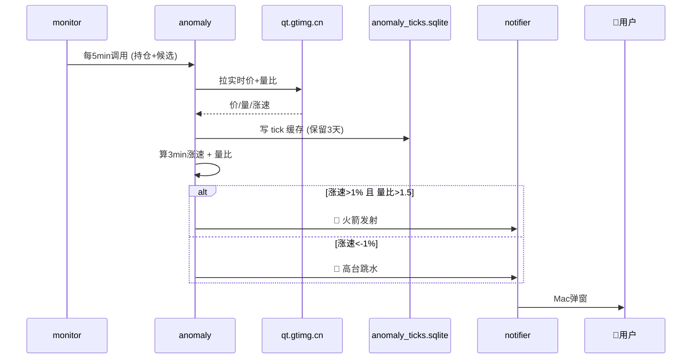
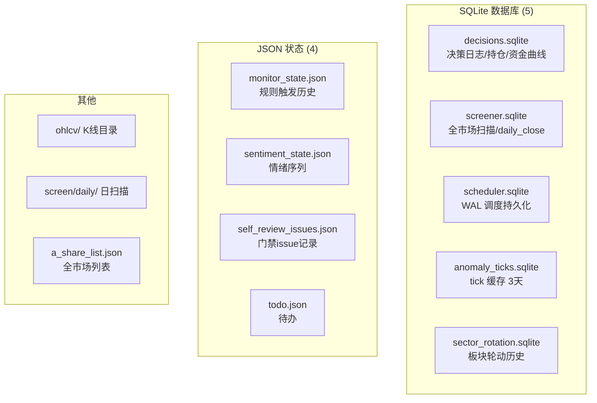

# A股决策系统架构 (v1.0)

> 2026-06-27 · 发现→确认→执行→复盘 闭环
> 78,788 → 100,000 (+26.9% in 187d), P(达成) 0.2%

## 分层架构

```mermaid
graph TB
    subgraph 数据源["🌐 数据源层 a_stock_data/"]
        EM[东财 eastmoney<br/>资金流/板块/龙虎榜/研报]
        TX[腾讯 tencent<br/>实时报价 qt.gtimg.cn]
        THS[同花顺 ths<br/>热度/EPS/北向]
        FN[新浪 financials<br/>三表/公告 filings]
        SC[板块排行 sectors]
        OH[ohlcv<br/>K线/技术指标]
    end
    end

    subgraph 发现["🔍 发现层 (策略+早盘+异动)"]
        STR[strategies/<br/>5策略 Signal Bridge<br/>→ 信号聚合 → topM]
        MS[morning_scan<br/>9:35/9:50 策略候选+5维评分<br/>→ 信号桥接 → top5推送]
        AN[anomaly<br/>火箭发射/高台跳水<br/>3min涨速+量比]
        SR[sector_rotation<br/>板块轮动持续性<br/>4指标 + 资金流加强]
    end

    subgraph 评分["📊 评分层 scorers/"]
        TOT[total_scorer<br/>综合评分 + 否决]
        TC[technical<br/>技术面 35%]
        MF[moneyflow<br/>资金面 35%]
        FD[fundamental<br/>基本面 10%]
        SS[sector<br/>板块 10%]
        EV[event<br/>事件 10%]
    end

    subgraph 确认["✅ 确认层"]
        DR[deep_research<br/>DCF+Comps+DD清单]
        SRV[self_review<br/>门禁 critical>0→阻断]
        BRF[生产者简报 brief]
    end

    subgraph 调度["⏰ 调度层"]
        SCH[scheduler<br/>多时间点+6段时段+节假日]
        CR[cron<br/>交易时段每5min触发]
    end

    subgraph 执行["⚡ 执行层"]
        MON[monitor<br/>11条规则+异动+非阻塞锁]
        RUL[rules.yaml<br/>规则配置]
        NOT[notifier<br/>osascript + RateLimiter三闸门]
        PS[position_sizer<br/>凯利公式]
        DL[a_screen/decision_log<br/>决策DB读写]
    end

    subgraph 复盘["📊 复盘层"]
        CS[close_scan<br/>15:10盘后落盘]
        SEN[sentiment<br/>北向+龙虎榜+研报热度 0-100]
        GS[goal_sim<br/>蒙特卡洛 P(达成)]
        RM[risk_metrics<br/>Sharpe/MaxDD/波动率]
        STA[stats<br/>胜率/纪律分析]
    end

    subgraph 辅助["🛠 辅助"]
        MC[macro_calendar<br/>宏观事件]
        TD[todo<br/>待办系统]
        LOG[log.py<br/>CLI写入DB]
    end

    subgraph 存储["💾 存储 data/"]
        DB1[(decisions.sqlite)]
        DB2[(screener.sqlite<br/>+daily_close)]
        DB3[(scheduler.sqlite WAL)]
        DB4[(anomaly_ticks.sqlite)]
        DB5[(sector_rotation.sqlite)]
        ST1[monitor_state.json]
        ST2[sentiment_state.json]
        ST3[self_review_issues.json]
    end

    %% 数据源 → 发现
    EM --> MS
    TX --> AN
    SC --> SR
    EM --> SR

    %% 策略层内部 (Signal Bridge)
    STR -.->|topM 候选| MS
    STR --> OH
    STR --> EM

    %% 发现层内部
    MS -.-> SR
    MS --> TOT
    TOT --> TC
    TOT --> MF
    TOT --> FD
    TOT --> SS
    TOT --> EV

    %% 发现/评分 → 确认
    MS -.-> DR
    DR --> SRV
    SRV -->|critical=0| BRF

    %% 确认 → 执行
    BRF --> PS
    PS --> DL
    DL --> DB1

    %% 调度 → 发现/执行
    CR --> SCH
    SCH --> MS
    SCH --> AN
    SCH --> CS
    SCH --> MON

    %% 执行层内部
    MON --> RUL
    MON --> AN
    MON --> TX
    MON --> NOT
    MON --> ST1
    MON --> DB1

    %% 复盘
    CS --> DB2
    DL --> CS
    DL --> SEN
    DB2 --> SEN
    DL --> GS
    DL --> RM
    DL --> STA

    %% 辅助
    LOG --> DL
    MC -.-> MON
    TD -.-> LOG

    %% 推送 → 用户
    NOT -.推送.-> USER[👨 用户<br/>看弹窗→券商app下单]
    MS -.推送.-> USER

    style MS fill:#e1f5ff,stroke:#06c
    style AN fill:#e1f5ff,stroke:#06c
    style SR fill:#e1f5ff,stroke:#06c
    style DR fill:#fff5e1,stroke:#c80
    style SRV fill:#fff5e1,stroke:#c80
    style MON fill:#ffe,stroke:#c90
    style NOT fill:#ffe,stroke:#c90
    style USER fill:#e1f5e1,stroke:#3c3
```

## 策略层内部架构 (Signal Bridge)

```mermaid
graph TB
    subgraph 策略容器["strategies/"]
        BASE[base.py<br/>StrategyMeta + BaseStrategy<br/>META/filter/signals 三段式]

        REG[registry.py<br/>importlib 目录反射<br/>自动注册]

        SGN[signals.py<br/>Signal{code,action,<br/>confidence,strategy,reason}]

        RUN[runner.py<br/>build_indicators<br/>→ run_all → SignalVote]

        NL[near_limit_up<br/>逼近涨停<br/>涨>7%+距涨停<3%]
        TB[trend_breakout<br/>趋势突破<br/>close>ma60+新高+量比≥2]
        OB[oversold_bounce<br/>超跌反弹<br/>RSI<30+收阳+量比≥1.2]
        MF[moneyflow_surge<br/>资金流异动<br/>东财净流入排名]
        SM[sector_momentum<br/>板块动量<br/>轮动领头羊]
    end

    subgraph 数据输入["数据源"]
        OH[ohlcv/ K线 + 技术指标]
        EM[东财 资金流/板块]
        TX[腾讯 实时价]
    end

    subgraph 输出["输出到 morning_scan"]
        WL[watchlist<br/>SignalVote 聚合 topM]
    end

    OH --> RUN
    EM --> RUN
    TX --> RUN

    REG --> RUN
    BASE --> NL
    BASE --> TB
    BASE --> OB
    BASE --> MF
    BASE --> SM

    RUN --> SGN
    SGN -->|SignalVote| WL

    NL -.-> RUN
    TB -.-> RUN
    OB -.-> RUN
    MF -.-> RUN
    SM -.-> RUN

    style NL fill:#0d4194,stroke:#58a6ff
    style TB fill:#0d4194,stroke:#58a6ff
    style OB fill:#0d4194,stroke:#58a6ff
    style MF fill:#0d4194,stroke:#58a6ff
    style SM fill:#0d4194,stroke:#58a6ff
```

### Signal 数据流 in morning_scan



## 核心数据流 (发现→确认→执行→复盘)



## 模块依赖关系



## 评分权重



## 监控规则分类



## 异动检测流程



## 存储结构



## 缺口 & 待改进

| # | 缺口 | 影响 | 优先级 |
|---|------|------|--------|
| 1 | 无 parquet 存 enriched 全市场 | 情绪/回测需重拉, 计算冗余 | 低 |
| 2 | 无多券商对接 | 仅弹窗, 不能自动下单 (设计如此) | — |

## 技术债 & 约束

- **Python 3.12+** · **SQLite (5 库)** · **无外部消息队列**
- 所有模块通过 `config.py` 共享路径/权重
- `scheduler.py` 是唯一入口调度器 (取代裸 cron)
- 通知限流三闸门: 20条/min + 0.5s间隔 + 错误锁定
- 非阻塞锁防重入: morning_scan, monitor, anomaly 均有 threading.Lock
