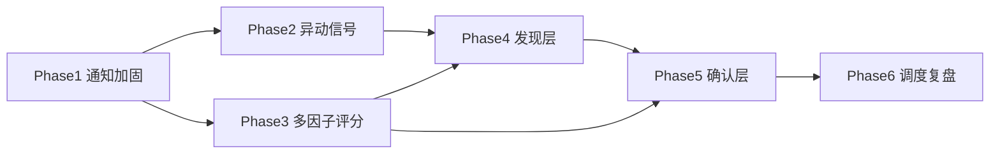

# v1.0 集成实施计划

> 财务专家 + 系统架构师双视角。
> 基于 6 个 GitHub 参考项目研究 (见 `docs/research/2026-06-27-reference-projects-study.md`)。
> 架构图见 `docs/architecture/2026-06-27-system-architecture.md`。

## 目标

把 v0.5 (9 价格规则 + 6 标的) 升级到 v1.0 (发现→确认→执行→复盘闭环)。
不重写, 全部增量集成。每个 Phase 独立可测, 出错不连累已有功能。

## 设计原则

```
财务专家:  发现≠买 (watchlist等回踩→确认层过滤→才设买点)
架构师:   分层单向 (发现→watchlist→确认→执行, 不回流)
共同:     可回测优先 (量化评分, 不用LLM-as-judge)
          避坑参考项目 (不假并行/补WAL/通知限流/任务持久化)
```

## 6 个 Phase (按依赖排序)

### Phase 1: 通知层加固 (周一前必须)

**为什么先做**: 现有 notifier 无限流重试, 高频触发会被封。这是地基。

**改 `a_stock/notifier.py`**:
- 抄 a-share-quant-selector 的 `RateLimiter` 三闸门 (配额20/间隔2s/限速锁定)
- 加重试 (1s→2s→4s→8s, 区分错误类型)
- 加大消息分段 (>18KB按行切, UTF-8安全chunk)
- 保留现有 osascript 推送, 限流重试套在外层

**验收**: `notifier test` 连发 30 条不丢, log 全 ✓

---

### Phase 2: 异动信号 (周一前必须)

**为什么**: 现有 monitor 只看价格到点, 错过火箭发射/高台跳水。

**新 `a_stock/anomaly.py`**:
- 抄 kimi 的涨速算法 (`searchsorted` 二分定位 3分钟前)
- 抄量比算法 (`resample('1min').last().diff()` 处理累计量)
- 触发: 火箭发射(涨速>1.0% 且 量比>1.5) / 高台跳水(涨速<-1.0%)
- **修 kimi 午休 bug**: SQL加交易时段过滤 (9:25-11:30 / 13:00-15:00)
- tick 存 `data/anomaly_ticks.sqlite` (code,timestamp,price,volume,change_pct)

**改 `a_stock/monitor.py`**:
- 主循环加异动检测 (每5分钟回溯算涨速/量比)
- 命中→推送 + 写 monitor_log
- 加非阻塞锁防重入 (`acquire(blocking=False)`, 抄 aiagents-stock)

**验收**: 模拟一只票3分钟涨1.5%, 触发火箭发射推送

---

### Phase 3: 多因子评分 (1周内)

**为什么**: 现有 position_sizer 纯凯利, 无综合评分。机会排序靠拍脑袋。

**改 `a_stock/position_sizer.py`**:
- `Candidate` 加 `score: float` + `score_level: str` 字段
- 抄 KHunter 权重 35/35/10/10/10 (技术/资金/基本面/板块/事件)
- **改归一化**: 每因子先 clamp [0,100] 再加权 (修 KHunter 缺陷)
- **只抄3类真veto**: 技术面(M头+多死叉) / 资金面(5日净流<-1亿) / 事件(ST/暴雷)
- 抄分档评分形态 (moneyflow _score_main_net_flow)
- `suggest()` 用 score 缩放仓位: <40→0 / 40-60→半仓 / ≥80→满仓×Kelly
- **不抄**: KHunter 技术面读"策略命中表" (我直接算MA/MACD/RSI)

**新 `a_stock/scorers/` 目录**:
- `technical_scorer.py` (MA/MACD/RSI 分档, 用现有 OHLCV)
- `moneyflow_scorer.py` (5日主力净流分档, 用现有 fund_flow)
- `fundamental_scorer.py` (净利同比/ROE/OCF, 用现有 financials)
- `sector_scorer.py` (板块排名, 用现有 sectors)
- `event_scorer.py` (ST/暴雷/减持, 简化版)

**验收**: 跑 515650/600276/515880, 输出各因子分+总分+level

---

### Phase 4: 发现层 (2周内)

**为什么**: 现有只盯6标的, 错过板块轮动和全市场机会。

**新 `a_stock/morning_scan.py`**:
- 9:35/9:50 cron 触发 (抄 aiagents-stock 多时间点注册)
- 全市场扫描用现有 `screener.py` (东财push2批量, 比参考项目强)
- top候选用 Phase 3 多因子评分排序
- 推送"今日候选top5" + 写 watchlist
- 非阻塞锁防重入 (LLM分析易超时)
- **不抄**: aiagents-stock 假并行 / LLM-as-judge / pywencai单点依赖

**新 `a_stock/sector_rotation.py`**:
- 抄 quantdash 四指标持续性算法 (200行纯Python)
- streakDays / topThreeAppearances / strengthDelta / strongestRepeat
- **加强**: 加资金流字段 (quantdash 局限: 只看pctChange)
- 输出: 持续主线 / 轮动 / 衰退 板块分类
- 写 `sector_rotation` 表 (不用JSON双源)

**新 `a_stock/strategies/` 目录**:
- 抄 tickflow 策略=信号列组合模式
- `base.py` (META+filter+signals 三段式)
- `trend_breakout.py` / `near_limit_up.py` (含动态涨停价5/10/20/30%)
- `oversold_bounce.py` (RSI<30+收阳+量比)
- 新增策略零成本 (组合已有信号列)

**验收**: 周一9:35 推送候选top5 + 板块持续性报告

---

### Phase 5: 确认层 (3周内)

**为什么**: 发现≠买。需要深研过滤, 避免追高。

**新 `a_stock/deep_research.py`**:
- 抄 UZI 17法选6个: DCF + Comps + beat/miss + 催化剂 + DD清单 + Segmental
- A股参数化 (rf=2.5% / ERP=6% / 税率25% / 终值g=2.5%)
- 输出: 估值区间 + 时机 + 排雷 + 业务拆解
- **不抄**: UZI 22维全套 (太重, 选6个够用)

**新 `a_stock/self_review.py`**:
- 抄 UZI 物理门禁 (critical>0 raise RuntimeError, 不出建议)
- 每条 issue 带 suggested_fix (agent可自愈)
- **BUG→check→测试闭环**: 每踩一个坑沉淀成 check + 回归测试
- 初始 check: 数据缺失/估值异常/建议无止损/仓位超限

**改 `a_stock/brief.py`**:
- 增强: 接 deep_research 输出
- self_review 通过才生成 brief

**验收**: 跑 600276 深研, 输出 DCF+Comps+DD, self_review 通过

---

### Phase 6: 调度+复盘层 (4周内)

**为什么**: 多时间点编排 + 盘后落盘 + 周复盘。

**新 `a_stock/scheduler.py`**:
- 抄 aiagents-stock 多时间点注册+热重载
- **补持久化** (aiagents-stock重启丢失, 我存DB)
- **补WAL** (aiagents-stock无WAL有locked风险)
- 6段交易时段判断 (集合竞价/午休/尾盘, 抄 aiagents-stock)
- **补节假日** (aiagents-stock未实现, 用 chinese_calendar 库)

**新 `a_stock/close_scan.py`**:
- 15:10 盘后落盘
- 全天资金流final + 研报数 + 情绪温度
- 写 candidate_history (DB, 不用Parquet/DuckDB, 我数据量小)
- 周日复盘用

**改 `a_stock/sentiment.py`**:
- 抄 quantdash 6阶段情绪周期 (退潮/冰点/修复/主升/试错/分歧)
- 抄修复率 (昨日炸板池票次日涨)
- 抄高位风险阈值 (A杀≤-8 / broken_rate≥35→high)
- 需确认 `eastmoney.py` 能拉涨停池/炸板池

**验收**: 周日跑复盘, 输出本周热点回溯+下周机会预判

---

## 实施顺序与依赖



- Phase 1+2 周一前必须 (地基+异动)
- Phase 3 1周内 (评分基础)
- Phase 4 2周内 (发现, 依赖3)
- Phase 5 3周内 (确认, 依赖3+4)
- Phase 6 4周内 (调度复盘, 收尾)

## 风险控制

```
每 Phase 独立 commit, 出错 git revert 不连累
每 Phase 写测试 (TDD, 抄 UZI BUG→check→测试闭环)
不破坏现有 9 条规则 + cron (周一照常跑)
集成前先 dry-run, 不直接动 DB
```

## 财务目标对齐

```
当前: 78,788 → 100,000 (P=0.1% 被动)
v1.0 后: 主动发现+确认+执行, 目标 P 提升到 30-40%
关键: 发现≠买, 每笔过确认层, 不追高
```

## 待确认

1. Phase 1+2 周一前做完, 周一能用增强版监控?
2. Phase 3-6 按 1/2/3/4 周节奏, 还是调整?
3. 哪些 Phase 你想先看代码再批准?
